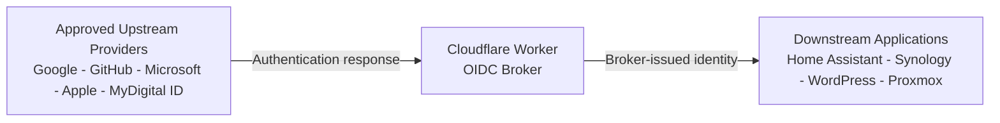
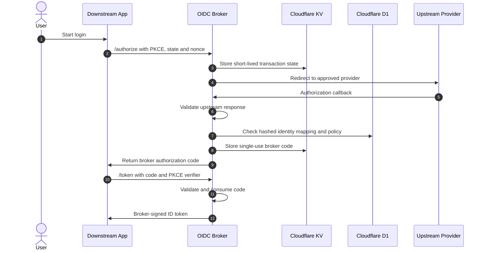

# 🔐 Cloudflare OIDC Broker

[](https://github.com/zubir2k/cloudflare-oidc-broker/stargazers)
[](https://workers.cloudflare.com/)
[](https://www.certification.openid.net/plan-detail.html?plan=wCGJeSQHOEVT2)
[](https://zubirco.de/buymecoffee)

A lightweight, serverless OpenID Connect identity broker built on **Cloudflare Workers**.

The broker federates approved upstream identity providers such as Google, GitHub, Microsoft, Apple, and MyDigital ID, then issues broker-controlled OIDC identities to self-hosted applications.

Downstream applications authenticate users without requiring direct integration with, or visibility into, the upstream identity provider and its identity attributes.

[](https://deploy.workers.cloudflare.com/?url=https://github.com/zubir2k/cloudflare-oidc-broker)

> [!IMPORTANT]
> Deployment alone does not make the broker functional. Complete the setup process to configure Cloudflare D1, KV, signing keys, secrets, downstream clients, upstream providers, and user authorization mappings.

> [!NOTE]
> This is an independent, community-driven project. It is not affiliated with, endorsed by, certified by, or sponsored by Cloudflare, the OpenID Foundation, or any supported upstream identity provider. All product and company names are trademarks of their respective owners.

---

## 🎯 Why This Exists

Many self-hosted applications support OpenID Connect, but integrating each application separately with multiple identity providers creates duplicated configuration, inconsistent claims, and unnecessary exposure of identity attributes.

This broker provides a controlled federation layer between applications and approved upstream providers.

### Key capabilities

- **Broker-controlled identity:** Applications trust an issuer under your own domain rather than integrating separately with every upstream provider.
- **Modular providers:** Supported providers can be enabled or disabled centrally without redesigning downstream applications.
- **Upstream abstraction:** Applications receive broker-issued identities and do not need to know which upstream provider authenticated the user.
- **Per-application authorization:** Access can be granted or denied for each registered downstream client.
- **Per-application mapping:** The same authenticated user can map to different local usernames for different applications.
- **Subject isolation:** Each downstream client receives a deterministic, client-specific `sub`, reducing cross-application correlation.
- **Controlled PII visibility:** Upstream attributes are handled during authentication and are not forwarded downstream unless explicitly configured.
- **Hashed identity references:** Persistent mappings use broker-controlled derived identifiers instead of raw upstream PII.
- **No upstream token delegation:** Upstream access tokens and ID tokens are not passed to downstream applications.
- **OAuth 2.1-aligned flow:** Authorization Code Flow with PKCE S256 is enforced. The implicit flow is not supported.
- **Cryptographic validation:** Upstream ID tokens are validated for applicable signature and claim requirements.
- **Serverless operation:** Runs on Cloudflare Workers, D1, and KV without a dedicated application server.

---

## 🔒 Privacy Boundary

The broker acts as a privacy boundary between upstream identity providers and downstream applications.



By default:

- Downstream applications do not receive upstream tokens.
- Downstream applications do not require upstream provider identifiers.
- Each application receives an isolated broker-issued identity.
- Persistent mappings use hashed identity references.
- Raw upstream PII is not intended to be persisted in D1 or KV.
- Upstream providers can be enabled or disabled without reworking downstream integrations.

The broker necessarily processes selected upstream attributes during authentication. For the full trust model, PII handling, operator responsibilities, and limitations, see [SECURITY.md](SECURITY.md).

---

## 🏗️ Architecture



### Cloudflare components

| Resource | Product | Purpose |
|---|---|---|
| OIDC endpoints | Workers | Authorization, callback, token, userinfo, revocation, logout, and discovery |
| Client registry | D1 | Registered clients and approved redirect URIs |
| Identity mappings | D1 | Hashed identity references, local usernames, and authorization status |
| Ephemeral state | KV | Short-lived state, PKCE data, authorization codes, and sessions |
| Administration | Workers + Cloudflare Access | Client, mapping, and provider management |

---

## 🧩 Modular Provider Model

Provider modules sit behind a shared interface and central registry.

```text
src/providers/
├──  types.ts
├──  registry.ts
├──  google.ts
├──  github.ts
├──  microsoft.ts
├──  apple.ts
└──  mydigitalid.ts
```

A provider being present in the source code does not automatically make it trusted. It must be explicitly configured and enabled by the deployment operator.

Provider modules are responsible for building upstream requests, validating callbacks and tokens, normalizing provider-specific identity data, and returning only the information required by the broker.

---

## 🔌OIDC Endpoints

| Endpoint | Method | Description |
|---|---|---|
| `/.well-known/openid-configuration` | `GET` | OIDC discovery document |
| `/.well-known/jwks.json` | `GET` | Broker public key set |
| `/authorize` | `GET` | Starts authorization |
| `/callback` | `GET` | Receives upstream callback |
| `/token` | `POST` | Exchanges a broker code for tokens |
| `/userinfo` | `GET` | Returns configured broker-issued claims |
| `/revoke` | `POST` | Revokes a token |
| `/logout` | `GET` | Handles broker and RP-initiated logout |
| `/<admin>/*` | `GET`, `POST` | Administrative console and operations |

---

## 🚀 Quick Start

### 1. Prerequisites

- Cloudflare account
- Wrangler CLI installed and authenticated
- Domain or subdomain for the broker issuer
- Credentials for each upstream provider you enable
- Downstream application with OpenID Connect support

### 2. Clone the repository

```bash
git clone https://github.com/zubir2k/cloudflare-oidc-broker.git
cd cloudflare-oidc-broker
```

### 3. Create Cloudflare resources

```bash
npx wrangler d1 create oidc-broker-db
npx wrangler kv namespace create SESSIONS_KV
npx wrangler d1 execute oidc-broker-db --remote --file=schema.sql
```

### 4. Configure the Worker

```bash
cp wrangler.toml.example wrangler.toml
```

Update `wrangler.toml` with the D1 and KV identifiers. Enable only the upstream providers required for the deployment.

### 5. Generate an RS256 key pair

```bash
node -e "
const { webcrypto } = require('crypto');
(async () => {
  const { privateKey, publicKey } = await webcrypto.subtle.generateKey(
    {
      name: 'RSASSA-PKCS1-v1_5',
      modulusLength: 2048,
      publicExponent: new Uint8Array([1, 0, 1]),
      hash: 'SHA-256'
    },
    true,
    ['sign', 'verify']
  );
  const privateJwk = await webcrypto.subtle.exportKey('jwk', privateKey);
  const publicJwk = await webcrypto.subtle.exportKey('jwk', publicKey);
  publicJwk.kid = crypto.randomUUID();
  privateJwk.kid = publicJwk.kid;
  console.log('PRIVATE:', JSON.stringify(privateJwk));
  console.log('PUBLIC: ', JSON.stringify(publicJwk));
})();
"
```

Do not commit the private key to version control.

### 6. Set secrets

Set only the secrets required by enabled providers.

```bash
npx wrangler secret put UPSTREAM_GOOGLE_CLIENT_SECRET
npx wrangler secret put UPSTREAM_GITHUB_CLIENT_SECRET
npx wrangler secret put BROKER_PRIVATE_KEY_JWK
npx wrangler secret put ADMIN_API_TOKEN
```

### 7. Deploy

```bash
npx wrangler deploy
```

### 8. Configure the issuer

Add a stable custom domain such as:

```text
id.example.com
```

Register the broker callback with each enabled upstream provider:

```text
https://id.example.com/callback
```

Then register each downstream client with a unique `client_id`, exact redirect URIs, required claims, and explicit identity mappings.

---

## 🛡️ Security Overview

The project includes controls such as:

- Authorization Code Flow with PKCE S256
- Registered redirect URI validation
- State and nonce validation
- Upstream signature and claim validation
- Single-use broker authorization codes
- RS256-signed broker ID tokens
- Client-specific subject identifiers
- Provider allowlisting
- User and client suspension controls
- Restricted cross-origin behavior
- `Cache-Control: no-store` on sensitive responses

These controls do not remove the need to trust the broker operator, deployed code, Cloudflare account, configured providers, administrative controls, and downstream clients.

For the full security model, privacy considerations, deployment guidance, vulnerability-reporting process, and conformance limitations, read [SECURITY.md](SECURITY.md).

---

## ✅ Tested Downstream Applications

- Home Assistant using [cavefire/hass-openid](https://github.com/cavefire/hass-openid)
- Synology DSM OIDC SSO
- WordPress
- Proxmox VE

Compatibility with one deployment does not guarantee compatibility with every version, plugin, or configuration.

---

## ✅ OpenID Connect Conformance Testing

The broker has been tested using the official OpenID Foundation Conformance Suite for the Basic OP profile.

[View the public Basic OP test plan](https://www.certification.openid.net/plan-detail.html?plan=wCGJeSQHOEVT2)

Passing the selected tests is evidence of the protocol behaviors covered by the test plan. It is not the same as OpenID certification and does not guarantee overall security, production readiness, regulatory compliance, or correct deployment configuration.

---

## 🚧 Project Scope

This project is intended to remain a lightweight OIDC federation broker. It is not presented as a complete enterprise identity and access management platform.

The project may not provide features such as LDAP, SAML, SCIM, identity lifecycle governance, formal assurance-level evaluation, hardware-backed key management, regulatory certification, or guaranteed high availability.

---

## 🤝 Contributing and Security Reports

- [Open an issue](https://github.com/zubir2k/cloudflare-oidc-broker/issues)
- [Read the contributing guidelines](CONTRIBUTING.md)
- [Report a vulnerability privately](SECURITY.md)

Do not post sensitive vulnerability details in a public issue.

---

## 📄 License

This project is licensed under the MIT License. See [LICENSE](LICENSE).

Made with 🔐 by [Zubir Jamal](https://zubir.tech)

